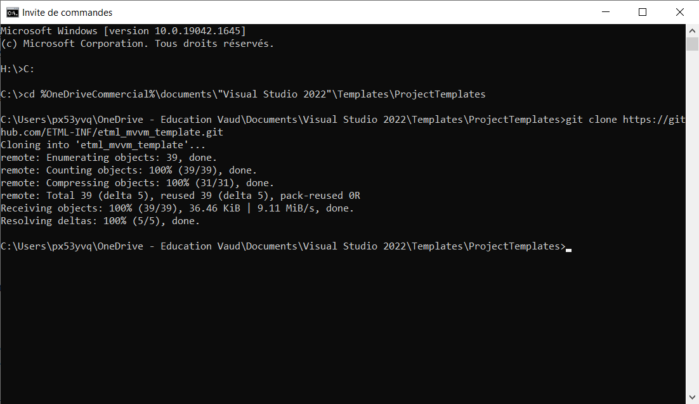
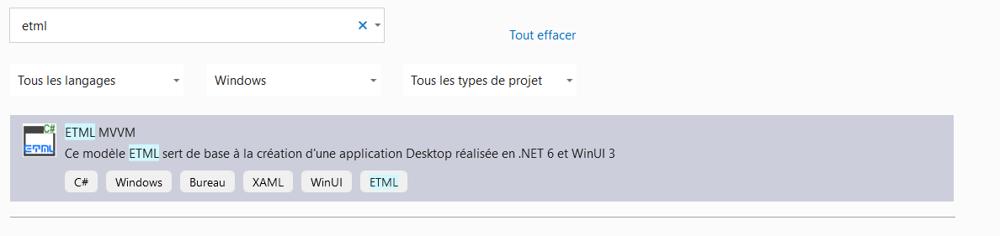
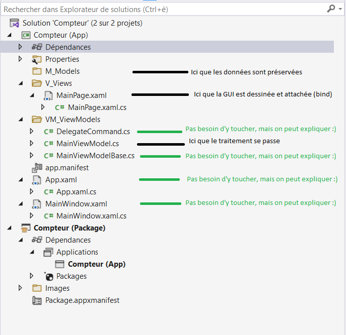

# ETML MVVM Template
Ce template génère une solution avec deux projets :

1. Application
2. Package

Le développement se fait dans le projet **Application** et le livrable est produit par le projet **Package**.

## Prérequis

Visual Studio 2022
.NET 6
(A compléter)


## Installation
Le dossier etml_mvvm_template doit être télechargé vers **%userprofile%\Documents\Visual Studio 2022\Templates\ProjectTemplates**

/!\ Si le template n'apparaît pas dans la liste des propositions de projets de Visual Studio, la cause est à chercher dans le(s) fichier(s) .vstemplate.

Néanmoins, le plus simple est de cloner ce dépôt git vers votre machine. Pour ce faire, ouvrez une commande DOS et tapez les commandes suivantes :

```
C:
cd %OneDriveCommercial%\documents\"Visual Studio 2022"\Templates\ProjectTemplates
git clone https://github.com/ETML-INF/etml_mvvm_template.git
```



Si vous avez synchronisé (fonction backup de OneDrive) votre bureau et vos documents, il faut utiliser la variable d'environnement **%OneDriveCommercial%**, sinon il faut utiliser **%userprofile**

## Utilisation du template

Le template est disponible depuis le menu création d'un nouveau projet de l'IDE Visual Studio.


Comme Visual Studio propose de nombreux projets, il peut être utile de :

* Utiliser la barre de recherche (la recherche est active sur le nom du projet et ses tags). Nous recommandons d'utiliser le mot clé **ETML**
* Attacher (pin) le projet pour le retrouver plus facilement par la suite.

## Description des éléments d'un nouveau projet vide


La solution dans Visual Studio ressemble à ceci. 

En vert : les éléments de soutien que le template apporte (le développeur n’a pas besoin d’y apporter de modifications
En noir : les éléments où le développement se fait. 

Le template de base propose une application mono-page, mais plusieurs classe de type « ModelView » pourrait être crée par page supplémentaire. Le conteneur « Window » s’occupe de charger la page principale (MainPage) dans une frame.


## Exemples
[Exemple Compteur simple](docs/Example%20Counter.md)
