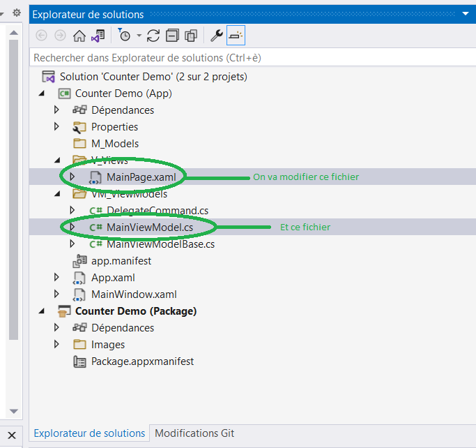

# Counter

Le projet vide crée contient un exemple simple. Cette exemple n'est pas immédiatement visible, il faut procéder à quelques petites manipulations

|  |
|:--:|
| <b>Figure 1 : Counter Example</b>|

Pour activer cette exemple, procédez ainsi :

Les changements concernent uniquement deux fichiers :

|  |
|:--:|
| <b>Figure 2 : Files to update</b>|

1. Double cliquez sur **MainPage.xaml**
2. Réperez les blocs commentés. Ils se trouvent entre les chevrons : <!-- -->
3. Décommentez
4. Double cliquez sur **MainPage.xaml**

# Qu'est-ce que nous avons fait ?

|  |
|:--:|
| <b>Figure 2 : Counter Example (scope)</b>|
